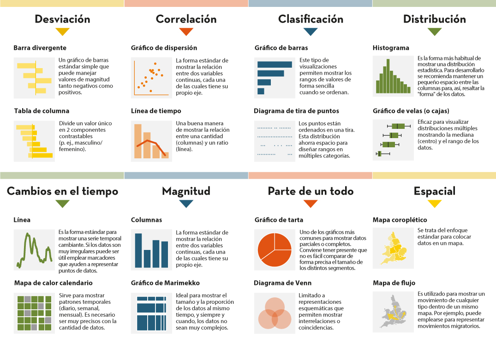
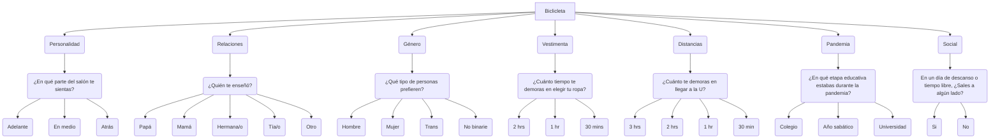
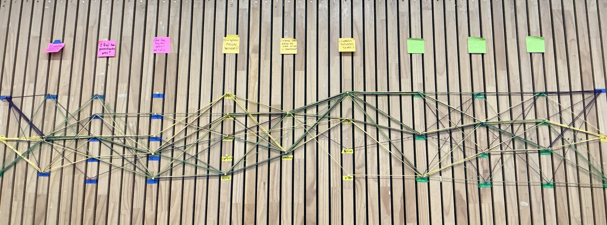
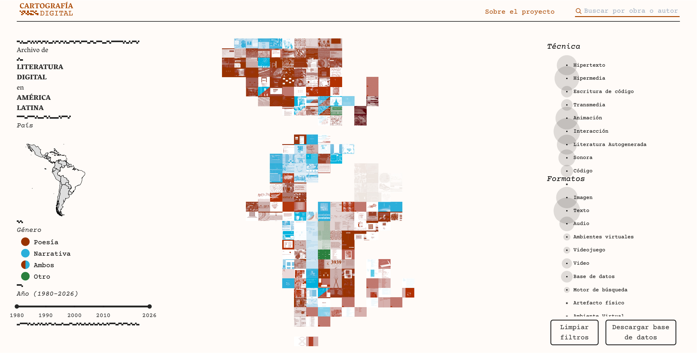

# ⋆⭒˚.⋆ Primera clase - presentación ⋆.˚⭒⋆

Martes 10 de Marzo 2025

***

## Observaciones

La primera clase. Esta comenzó a las 14:45.

Los docentes son "Sergio Mora" y "Joaquín González", el ayudante es "Martín Ogueta".

El taller se centra en la investigación y recopilación de datos, para trabajar con estos y generar espacios/istalaciones.
Se trabaja con maquinaria, experimentación visual, pantallas, programación, iluminación, museografía, entre otras.
Vinculación entre lo humano y la tecnología. Algo relevante es generar herramientas para recopilar información.

Tras una breve introducción por parte del equipo y su trayectoria, además de los contenidos del curso, se dio la dinámica de presentación de les estudiantes, con el objetivo de conocer datos como el nombre, mención, talleres previos, experiencia, etc.

La comunicación se realiza por correo y por canvas. Las herramientas digitales a utilizar son Drive, Linktree, Miro y próximamente discord.

***

## Introducción

La metodología requiere de un levantamiento de informacion en el que se trabaja con problemáticas, para poder realizar una instalación.
LA idea es poder ahondar cada vez más en el problema, volverse experto para luego poder generar una instancia con un objetivo (educación, entervención, etc).

Analisis en torno a distintas escalas y contextos. Descubrir un sistema de orden, medida de escala, para luego realizar gráficas y completos lo más precisos posibles según el fenómeno a medio.

***

## ¿Que es un Dato?

Cualquier tipo de información que uno puede recuperar de un objeto, un hecho o fennómeno, etc, que pueda formar parte de un grupo (Sistematización de información, según frecuencia, relevancia, atractivo, etc). Existe información cuantificable, visual, geolocalización,  cualificable, etc.

Al tener un solo dato, puede no ser relevante, pero al entrar en el terreno en el que se reunen multiplicidad de estos se pueden realizar aciertos.
La correlación de datos distintos permite identificar patrones y nuevos hayazgos, además de concluciones.

***

## Visualizacíón de datos

Diseñar nuevos soportes, dispositivos, experiencias. Se proponen entornos comunicativos que logren dejar marca en quien se encuentra en dicho espacio.

Abordan temas que requieren de una expresión visual.

Se mostró una [imagen](https://datos.gob.es/es/blog/como-elegir-el-grafico-correcto-para-visualizar-datos-abiertos) en la que se muestran variedades de gráficos y cómo se utilizan.

***

## Ejercicio: Grupos por actividad deportiva

Les estudiantes se agruparon por tipos de actividades deportiva: bicicleta, baile y paracaidismo.
Cada grupo va a generar 3 preguntas para poder encontrar información: una de preferencia (cualificable, hace referencia a las opiniones), otra de clasificación (orden sin ejercer importancia, es medible) y otra de cuantificación (es observable y se puede medir).
Cómo un tipo de encuesta, hay que pensar en las posibles respuestas. Hay que pensar en el usuario y los datos a recopilar.
La bicicleta sirve como un "objeto" para dar inicio a conversaciones que se involuran de forma directa o indirecta, a modo de poder descubrir más acerca de quienes integran el curso.

### Anotaciones

¿Qué es una bicicleta?
Es un objeto cotidiano, que se usa para deporte y transporte. Permite hacer mayores recorridos, es más cercano, más común que las otras actividades y menos osado. Nos permite saber mucho de alguien. Por ejemplo, estilo de vida, distancias, horarios, etc, y este mismo tema nos puede ir desvelando más información.

*Pequeño diagrama:*

_*En comentarios ocultos se encuentra la información escrita_

<!-- 
Bicicleta =D Cualificable =D Personalidad y atrevimiento =D ¿En qué parte del salón te sientas? Adelante, en medio, atrás (según animo, interés, etc)
          =D Relaciones =D ¿Quién te enseñó?
          =D Género =D ¿Qué tipo de personas prefieren?
          =D Vestimenta =D ¿Cuánto tiempo te demoras en elegir tu ropa?
          =D Las distancias de las cosas =D ¿Cuánto se demoran en llegar a la U?, ¿Que tan cerca tienes acceso a un espacio de deporte (ginmacio, parque, etc)?
          =D Pandemia =D ¿En qué etapa educativa estabas durante la pandemia? Colegio (Enseñanza media), Sabático (Descanso, trabajo, etc), Universidad
          =D Nivel socialización =D En un día de descanso o tiempo libre, ¿Sales a algún lado?
-->

### Resultados

El resultado final de la actividad fue un montaje improvisado realizado con notas adhesivas, pinchos, maskin tape e hilos varios.

Las preguntas expuestas según los equipos fueron:

*A) Baile*

- ¿Cuántos ramos tienes? "3 - 0", "4 ", "5 o más"
- ¿Qué tan procrastinador eres? "0", "1", "2", "3", "4"
- ¿Qué tan digital eres? Del 1 al 5 "1", "2", "3", "4", "5"

*B) Paracaidismo*

- ¿Qué género musical prefieres? "Pop", "Reggeaton", "Tecno", "Clásica", "Rock"
- ¿Tienes un estilo de vida activo o sedentario? "Activo", "Sedentario"
- ¿Cuántos tatuajes tienes? "0", "1 - 5", "6 - 10", "Más de 10"

*C) Bicicleta*

- ¿En qué parte de la sala me siento? "Adelante", "Al medio", "Atrás"
- ¿Con cuánto tiempo me levanto antes de ir a clases? "3 hrs antes", "2hrs antes", "1 hr antes", "30min antes"
- ¿Cuántos días tengo de descanso? "5 ", "3 a 4", "1 a 2", "0"

### Conclusiones

Al observar los resultados de las respuestas se pueden destacar las respuestas con mayor concentración: 

- La mayoría de les estudiantes se encuentran cursando 4 o más cantidad de ramos
- Más personas se consideran un protractinador promedio
- Existe una tendencia en la que les integrantes (incluyendo equipo docente) se consideran más digitales que análogos
- El género músical que nadie escucha es la música clásica
- Al parecer existe menos gente sedentaria, aunque se encuentran casi empatados con las personas activas
- Hay una gran cantidad de personas que no poseen tatuajes, y solo 2 persona poseen 6 o más
- La distribución de les estudiantes en la sala parece bastante equitativa
- Muchos estudiantes despiertan 2hrs antes de una clase para prepararse
- Varias personas tienen al menos 2 a 3 días de descanso

***

## Encargo 01: análisis de datos a partir de imágenes y textos

Buscar un proyecto o referente que realice algún tipo de análisis de imágenes o de texto (por ejemplo: archivos fotográficos, redes sociales, colecciones de imágenes, entrevistas, etc). Este referente funcionará como punto de partida conceptual para el ejercicio de la primera unidad. 

El formato de presentación es una lámina cuadrada en formato digital que describa qué tipo de material analiza el proyecto y qué tipo de patrones o información busca revelar.

### Investigación: [Archivo de literatura digital en América Latina](https://www.cartografiadigital.cl/map)

Este proyecto se basa en una página web que funciona como un archivador de obras digitales de escritores latino americanos a la par que conecta con otros repositorios como el ["Atlas da Literatura Digital Brasileira"](https://www.observatorioldigital.ufscar.br/atlas-da-literatura-digital-brasileira/).

El sitio expone principalmente este contenido de forma visual a través de varios elementos gráficos: un mapa de la región compuesto por extractos de imágenes de los documentos ordenados por ubicación según el país, otro mapa en el que de forma acertada indica el país al que pertenece, un indicador del género de la obra publicada, una línea temporal del año de publicación, un listado de técnicas utilizadas y formatos cuya presencia se destaca por el tamaño de un círculo que les acompaña.

La presencia de la gráfica y los filtros existentes nos permite como “navegantes” el poder concluir y destacar información clave acerca de estos archivos: el principal género literario escrito en Chile es de carácter narrativo, la primera publicación digital se trata de un poema animado realizado en Argentina el año 1994, tras el 2023 no se han subido nuevas publicaciones en el mapa, entre otros.
Estos y más datos pueden ser recopilados tras recorrer en profundidad la web. A partir de ello me surge la idea de que en caso de ser posible, se puede obtener información acerca de las personas que visitan estas páginas, cuales son las preferencias de los lectores, sus ubicaciones aproximadas, horarios para visitar la página, entre otra información.

El tipo de “material” que analiza la web se centra en lo visual, exponiendo archivos de variados formatos en forma de portadas coloridas ordenadas de forma tal que simula ser un mapa. Utilizando elementos infográficos se permite encontrar patrones e indagar sobre el tipo de contenido, años de publicación, tipo de géneros escritos, técnicas y formatos digitales.  

Esto genera un atractivo para quien visita la página, puesto que no solo con navegar puede encontrar de forma dinámica creaciones de autores latinos, filtrando según los gustos e intereses del usuario.

***

## Links varios

- https://www.mslima.com
- https://www.jasondavies.com
- https://www.worldometers.info
- https://www.carbonmap.org/?lang=es
- https://www.cartografiadigital.cl/map (proyecto universidad)
- https://giorgialupi.com/dear-data (libro)
- https://www.domesticstreamers.com
- https://refikanadol.com/works/melting-memories/
- https://www.dwbowen.com/telepresent-wind
- https://www.aaronkoblin.com
